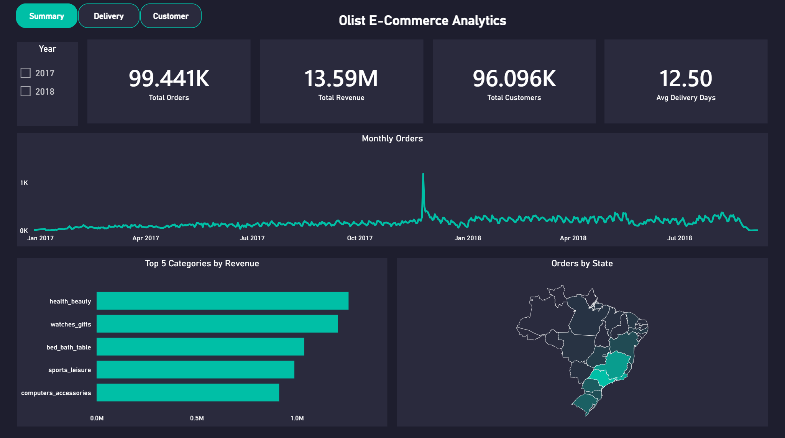
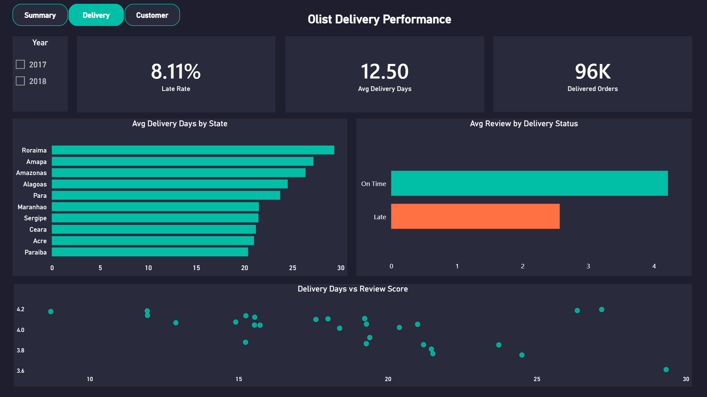
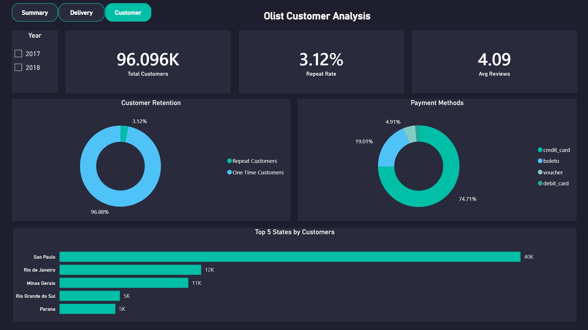

# Olist E-Commerce Sales & Operational Analytics

A data-driven analysis project evaluating sales performance, delivery efficiency, and customer behavior for a Brazilian e-commerce marketplace to drive business growth decisions.

## Project Overview

This project analyzes 99,000+ orders from Olist, a Brazilian e-commerce platform, to understand sales trends, delivery bottlenecks, and customer retention challenges. Through Excel exploration, SQL querying, and Power BI visualization, we've identified actionable insights and strategic recommendations.

## Dashboard Preview




**Business Impact:**
- **Revenue Concentration:** Top 5 categories generate ~40% of R$ 13.59M total revenue
- **Retention Crisis:** Only 3.12% of customers ever purchased twice
- **Delivery Gap:** 3.6x difference between fastest (SP: 8 days) and slowest state (RR: 29 days)
- **Satisfaction Risk:** Late deliveries drop review scores from 4.21 to 2.57 (-1.65 pts)

## Project Structure

```
├── sql/Olist_Queries.sql                         # SQL analysis (4 sections, 18 queries)
├── powerbi/Olist_Dashboard_Analysis.pbix         # Power BI interactive dashboard (3 pages)
├── excel/Olist_Excel_Analysis.xlsx               # Excel exploratory analysis
├── presentation/Olist_Presentation.pptx          # Executive presentation (10 slides)
├── screenshots/
│   ├── executive_summary.png
│   ├── delivery_performance.png
│   └── customer_analysis.png
└── README.md                                      # This file
```

## Key Files Explained

### 1. **sql/Olist_Queries.sql**
SQL Server queries organized in 4 sections:
- Import verification — row count validation for all 9 tables
- Data quality checks — missing values, anomalies (8 delivered orders without delivery date)
- Business questions Q1–Q6 using JOINs, GROUP BY, CASE WHEN, DATEDIFF
- Advanced queries — CTE (customer retention), Window Functions (RANK), HAVING, LEFT JOIN

### 2. **presentation/Olist_Presentation.pptx**
Executive-level presentation covering:
- Business problem and KPIs (99.44K orders, R$13.59M revenue, 96K customers)
- Sales & product performance (Black Friday peak, category analysis)
- Delivery performance & SLA (late rate, geographic gap, padded promises)
- Customer behavior & payment methods (retention, credit card dominance)
- 6 strategic recommendations with data backing

### 3. **powerbi/Olist_Dashboard_Analysis.pbix**
Interactive Power BI dashboard with 3 pages:

**Key Performance Indicators:**
- **Total Orders** — 99.44K
- **Total Revenue** — R$ 13.59M
- **Unique Customers** - 96K 
- **Avg Delivery Days** — 12.5 (varies 8–29 by state)

**Data Visualizations:**
- **Monthly Orders (Line Chart)** — Shows strong 2017 growth, 2018 plateau, and November 2017 Black Friday peak at 7,544 orders
- **Top 5 Categories by Revenue (Bar Chart)** — health_beauty leads at R$1.26M, top 5 = ~40% of total revenue
- **Orders by State (Map)** — São Paulo alone accounts for 42% of all orders
- **Avg Delivery Days by State (Bar Chart)** — RR at 29 days vs SP at 8 days (3.6x gap)
- **Avg Review by Delivery Status (Clustered Bar)** — On Time = 4.21/5 vs Late = 2.57/5
- **Delivery Days vs Review Score (Scatter Plot)** — Moderate inverse correlation (CORREL = -0.48)
- **Customer Retention (Donut Chart)** — 96.88% one-time vs 3.12% repeat customers
- **Payment Methods (Donut Chart)** — Credit card dominates at 74.71% of transactions

### 4. **excel/Olist_Excel_Analysis.xlsx**
Exploratory analysis workbook with one sheet per business question (Q1–Q6). Each sheet contains the question, summary finding, and PivotTable analysis. Includes Questions_Tracker for progress monitoring.
- Uses PivotTables, XLOOKUP, COUNTIF, IF, IFNA, CORREL, date arithmetic
- Note: Some delivery metrics differ slightly from SQL due to Excel date formatting issues. SQL figures are the primary source (verified manually on sample orders).

### Key Findings

1. **Sales Trend**
   - Strong growth through 2017 (800 → 7,544 orders/month), plateau in 2018
   - November 2017 peak: 7,544 orders (Black Friday)
   - Growth plateau in 2018: orders stabilized at ~6,200-7,300

2. **Revenue Concentration**
   - Top 5 categories = ~40% of total revenue (R$ 13.59M)
   - health_beauty leads (R$ 1.26M, 9,670 units)

3. **Geographic Concentration**
   - São Paulo alone = 42% of all orders
   - Top 3 states (SP, RJ, MG) = 66%
   - Northern states (RR, AP, AC) under 100 orders each

4. **Delivery Performance**
   - Average 12.5 days overall (SP: 8 vs RR: 29 — 3.6x gap)
   - Late delivery rate: 8.11% (7,826 of 96,470 delivered orders)
   - Orders arrive 11 days before estimated date — deliberately padded promises

5. **Customer Satisfaction**
   - Late orders: avg 2.57/5 vs on-time: 4.21/5 (1.65-point drop)
   - Delivery-review correlation: -0.48 (moderate inverse — speed matters but isn't the only factor)

6. **Payment & Retention**
   - Credit card: 74.71% of payments, highest avg order value (R$ 163)
   - Only 3.12% repeat purchase rate (2,997 of 96,096 customers)
   - Cancellation rate: 0.63% — very low

## Strategic Recommendations

### 1. Seasonal Planning
- Prepare inventory and logistics 3 months prior to Black Friday peak
- Expected Impact: Avoid stockouts during highest-volume period

### 2. Category Strategy
- Focus marketing and stock allocation on high-ticket categories (pcs, watches_gifts)
- Expected Impact: Higher revenue per marketing dollar spent

### 3. Geographic Expansion
- Expand regional marketing and localized logistics beyond São Paulo
- Expected Impact: Capture untapped demand in underserved northern states

### 4. Dynamic Logistics SLA
- Localize estimated delivery dates by state instead of one national promise
- Build fulfillment hubs in northern states
- Expected Impact: Reduce the 3.6x delivery gap and improve satisfaction

### 5. Retention Program
- Launch customer loyalty program and automated post-purchase retargeting
- Expected Impact: Boost the critical 3.12% repeat purchase rate

### 6. Payment Gateway Reliability
- Ensure high-availability monitoring for credit card checkouts (74% of sales)
- Offer flexible installment options
- Expected Impact: Protect the dominant revenue channel

## Technologies Used

- **Excel** - Exploratory analysis (PivotTables, XLOOKUP, CORREL)
- **SQL Server 2022** - Database, data validation, business queries (JOINs, CTEs, Window Functions)
- **Power Query** - Repeatable data cleaning pipeline connected to SQL Server
- **Power BI** - Star Schema modeling, DAX measures, interactive dashboard
- **DAX** - Dynamic measures (CALCULATE, TOTALYTD, DATEADD, DISTINCTCOUNT)
- **Canva** - Executive presentation design

## How to Use

### Quick Start
1. Review the **Olist_Presentation.pptx** for executive summary and recommendations
2. Explore the **Olist_Dashboard_Analysis.pbix** for interactive visual insights
3. Read **Olist_Queries.sql** for the full SQL analysis

### For SQL Analysis
```bash
# Open SSMS or VS Code with mssql extension
# Connect to localhost\SQLEXPRESS
# Open and run Olist_Queries.sql (select individual queries to execute)
```

### For Dashboard
1. Install SQL Server Express and SSMS
2. Download the Olist dataset from Kaggle (link above)
3. Create a database named `Olist`
4. Import the CSV files as tables with these names:
   - orders
   - order_items
   - order_payments
   - order_reviews
   - customers
   - products
   - sellers
   - category_translation
   - geolocation (optional — not used in dashboard)
5. Open Power BI Desktop
6. Open `Olist_Dashboard_Analysis.pbix`
7. If prompted: connect to SQL Server (`localhost\SQLEXPRESS`, database `Olist`)

| Metric | Value |
|--------|-------|
| Total Orders | 99,441 |
| Unique Customers | 96,096 |
| Total Revenue | R$ 13.59M |
| Repeat Purchase Rate | 3.12% |
| Late Delivery Rate | 8.11% |
| Delivery Gap (SP vs RR) | 8 vs 29 days (3.6x) |
| Late Impact on Reviews | -1.65 points |
| Dominant Payment | Credit card (74.71%) |


## Data Source

- **Brazilian E-Commerce Public Dataset by Olist** — [Kaggle](https://www.kaggle.com/datasets/olistbr/brazilian-ecommerce)
- 9 CSV files, ~99K orders, 2016–2018
- Real anonymized commercial data


---
## Author:
Prepared by: Lama Alhaidari
[LinkedIn](https://www.linkedin.com/in/lama-alhaidari0) | [GitHub](https://github.com/lamaalhaidari0)
*Last Updated: AUG 2026*
